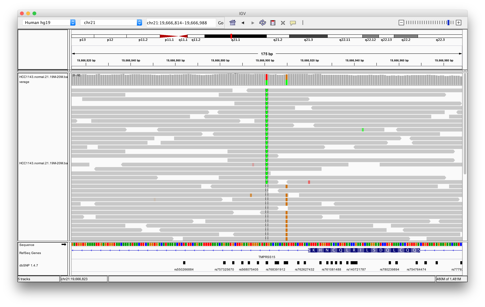
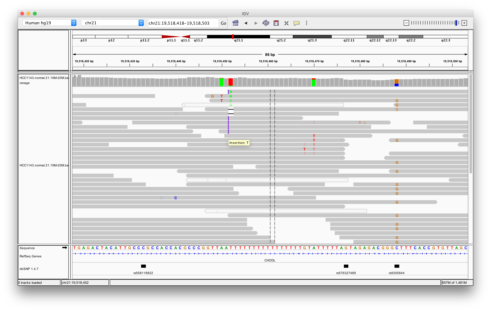
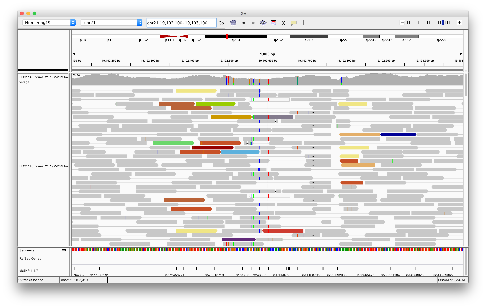
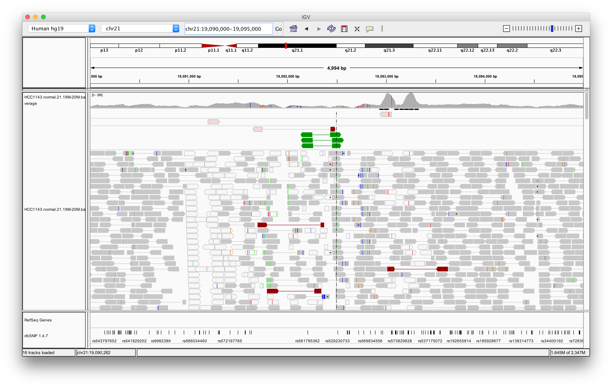

### Overview

In this section we will be looking at how IGV can be used for visualizing
mutations in sequence data. Here we consider the scenario in which genome
sequencing has been performed on a DNA sample, sequence reads have been
aligned to the reference genome and a variant caller such as GATK HaplotypeCaller
or MuTect2 has been run.

We will inspect some regions of the genome where there are possible variants
in a breast cancer cell line to determine whether these are real events or
artifacts. These will include single nucleotide variants (SNVs), small insertions
and deletions (indels) and larger structural rearrangements.

##### Acknowledgement

The material presented here is adapted from the excellent RNA-seq tutorial
from the Griffith lab at the McDonnell Genome Institute, Washington University School
of Medicine, St. Louis.

https://github.com/griffithlab/rnaseq_tutorial/wiki

-------------------------------------------------------------------------------------------

### HCC1143 data set

We will be using publicly available Illumina sequence data generated for the
HCC1143 cell line. The HCC1143 cell line was generated from a 52 year old caucasian
woman with breast cancer. Additional information on this cell line can be found here:
[HCC1143](http://www.atcc.org/products/all/CRL-2321.aspx) (tumor, TNM stage IIA, grade 3,
primary ductal carcinoma) and [HCC1143/BL](http://www.atcc.org/products/all/CRL-2362.aspx)
(matched normal EBV transformed lymphoblast cell line).

Sequence reads were aligned to version GRCh37 of the human reference genome. We will be
working with subsets of aligned reads in the region: chromosome 21: 19,000,000 - 20,000,000.

The BAM files containing these reads for the cancer cell line and the matched normal
are:

* `HCC1143.tumour.21.19M-20M.bam`
* `HCC1143.normal.21.19M-20M.bam`

These need to be indexed to be read into IGV. The index files have the .bai suffix and
allow IGV to navigate to a specified genomic location.

-------------------------------------------------------------------------------------------

### Load aligned sequence data

First we need to ensure that IGV is using the same reference genome as that to which
the sequence data were aligned, GRCh37.

* Select `Human hg19` from the drop-down list in the top left of the IGV window.

Now we're ready to load the sequence data.

* Select `File > Load from File...` from the main menu and select the BAM file `HCC1143.normal.21.19M-20M.bam` using the file browser.

$$ $$

This BAM file only contains data for a 1 megabase region of chromosome 21. Let's navigate
there to see what genes this region covers. To do so, either:

* Click on the Home button on the toolbar to jump to the whole genome view, select chromosome
21 in the drop-down list or in the 'genome ruler' in the top pane, then click and drag from
19mb to 20mb

* Enter `chr21:19,000,000-20,000,000` in the genome position box just to the left of the Home
button

**Note:** by default overlapping genes, e.g. on different strands, or different isoforms of a gene
are collapsed to a single line; these can be expanded by right-clicking the gene track and selecting `Expanded` from the menu.

The 1mb region contains too many reads to be displayed by IGV. We need to zoom in to see the
read alignments. There are several ways to do this:

* Double-click within the main panel (the one that currently says 'Zoom in to see alignments`); do
this a few times until aligned reads are loaded and displayed. Note that the view after zooming
is centred on the position that was clicked.

* Click and drag to select the desired region within the genome ruler

* Click on the `+` button on the slider at the top right of the IGV window, drag the slider bar
toward the `+` button, or click on one of the bars within the slider to go to the desired
zoom level.

-------------------------------------------------------------------------------------------

### SNVs in the coverage track

Possible variants are highlighted in the coverage track where the allele fraction is above a
configurable threshold. These are the coloured stacked bars within what is a mostly grey
coverage plot, where the coloured portion of each bar represents the fraction of reads with
different alleles at that position.

Zoom in on one of these coloured bars and hover the cursor over it to show a tooltip that
summarizes the number of reads aligned at the position for each of the different alleles.

The example shown above looks like a heterozygous single nucleotide polymorphism (SNP)
with an allele fraction of approximately 0.5. We can load an annotation track for the
dbSNP database of common polymorphisms to see if this is a known SNP.

* Select `File > Load from Server...` from the main menu and then select
`Available Datasets > Annotations > Variation and Repeats > dbSNP`

**Note:** it may take a few seconds to load the dbSNP track.

The dbSNP track is at the bottom of the IGV window. Black bars represent known SNPs.

**Note:** hovering over a SNP will display a tooltip containing more details about the SNP including population allele frequencies; clicking on a SNP will open the dbSNP entry in
your web browser.

We can adjust the allele fraction threshold above which the bar in the coverage track will
be coloured by allele read count instead of grey using the `View > Preferences` dialog.

* Select `View > Preferences...` from the main menu

* Select the `Alignments` tab from the preferences dialog

* Change the Coverage allele-fraction threshold to 0.01 and click the `OK` button.

Decreasing the threshold shows more possible variants, increasing the threshold results in
fewer variant positions. For example, on lowering the threshold to 0.01 we get several
additional coloured bars, many of which have a single read supporting an alternative
allele to that in the reference sequence. We'll use a threshold of 0.05 for the rest
of this tutorial.

* Reset the Coveage allele-fraction threshold to 0.05

Zoom out again and observe the uneven coverage across the region. In some parts of the
region the coverage drops to zero. It will be much more difficult to reliably identify
variants in a low coverage region.

We can load another annotation track for GC content to help understand why the coverage
is uneven.

* Select `File > Load from Server...` from the main menu and then select
`Available Datasets > Annotations > Sequence and Regulation > GC Percentage`

The coverage appears to correlate with GC content. Next-generation sequencing technologies
tend to lose coverage in regions with low GC content.

You can also use a collapsed view of the alignments which for this depth of sequencing
will allow all the aligning in this region to be visible without the need for scrolling.

* Right click in the main alignment track and select `Collapsed` from the menu

The read pileup mirrors the coverage track.

We'll now remove the GC Percentage track to allow more screen real estate for the read
alignments for the next part of the tutorial.

* Right click on the GC Percentage track and select `Remove Track` from the menu, then
click `Yes` to confirm

* Click and drag the divider between what was the GC Percentage track and the alignment
track to shrink the now empty upper track.

-------------------------------------------------------------------------------------------

### Examining read alignments

We're now going to examine read alignments at several genomic loci where there are
possible variants.

$$ $$

#### High confidence SNVs/SNPs

* Navigate to `chr21:19,479,200-19,479,800`

There are two heterozygous variants.

**Q1** *Which of these corresponds to a known SNP in dbSNP?*

**Q2** *What is the population allele frequency of the alternate (non-reference) allele?*

**Q3** *Why are some read alignments represented as coloured bars?*
(hint: bring up the tooltip for these reads and look at insert size, mate start and pair
orientation, compare with normal read alignments displayed as grey bars)

* Zoom in and centre on the C/T SNV on the left (chr21:19,479,321)

* Right click in the alignment track and select `Expanded`

* Right click in the alignment track at this exact position and select `Sort alignments by > base`

* Right click in the alignment track and select `Color alignments by > read strand`

* Open the view preferences dialog and ensure that the `Shade mismatched bases by quality`
setting is turned on

* Hover the cursor over the red T bases in reads that support the SNV to display a tooltip
providing useful details such as the the quality value for the T base or the read mapping quality

**Notes**

* High base qualities in all reads except one where the alternate allele is the last base in the read
* Good mapping quality of reads
* No strand bias
* Allele fraction consistent with heterozygous mutation

**Q4** *What does 'Shade base by quality' do and why might this be helpful?*

**Q5** *How does 'Color by read strand' help?*

-------------------------------------------------------------------------------------------

#### Heterozygous SNPs on different alleles

* Navigate to region `chr21:19,666,814-19,666,988`

* Sort by base (at position `chr21:19,666,901`)

* Right click in the alignment track and turn off colouring of reads (`Color alignments by > no color`)

**Note** *there is no linkage between alleles for these two SNPs because reads
covering both only contain one or the other*

-------------------------------------------------------------------------------------------

#### Homopolymer region with indel

* Navigate to region `21:19,518,420-19,518,505`

* Centre on the A within the homopolymer run (`chr21:19,518,470`), and `Sort alignments by -> base`

**Q6** *What do you notice about the reads with mismatches at this position?*
(hint: look at the position of the mismatch within the reads)

* Centre on the one base deletion on the left hand side of the poly-T run (`chr21:19,518,452`)
and `Sort alignments by -> base`

**Q7** *Why are some reads displayed in a light grey colour?* (hint: hover over these reads to
bring up the tooltip and see what is different about these alignments)

**Notes**

* The alternate allele is either a deletion or insertion of one or two Ts
* The remaining bases are mismatched in some reads because the aligner is penalizing
opening a gap more than 2 or 3 mismatches, i.e. these reads are misaligned

#### Repeat region

* Navigate to region `chr21:19,800,320-19,818,162`

* Load repeat tracks by selecting `File > Load from Server...` from the main menu and then select
`Available Datasets > Annotations > Variation and Repeats > Repeat Masker`

**Notes**

* Low mapping quality for all reads
* Several reads shown as light grey bars have zero mapping quality which means they
can be mapped somewhere else in the genome equally as well (or poorly)
* There are two LINE elements that cause probable misalignments

Variants called in repetitive regions should be treated with caution.

* Zoom in on the region containing a cluster of variant positions and sort the reads containing
mismatches by base at each position

**Q8** *Can you spot any patterns in the reads containing mismatches?*

**Q9** *Which of these variant positions is most likely to be a real SNV?*

#### Homozygous deletion

* Navigate to region `chr21:19,324,500-19,331,500`

* Right click in the main alignment track and select
  * `Expanded` view
  * `View as pairs`
  * `Color alignments by -> insert size and pair orientation`
  * `Sort alignments by -> insert size`

* Hover over one of the red read pairs to display information about the alignments
for both ends

**Notes**

* The average insert size of a read pair for this sample/library is 350bp
* Insert size of red read pairs is 2875bp
* This corresponds to a homozygous deletion of 2.5kb

#### Misalignment around Alu

* Navigate to `chr21:19,102,100-19,103,100`

**Notes**

* This is a position where AluY element causes misalignment
* Misaligned reads have mismatches to the reference and well-aligned reads have
partners on other chromosomes at locations where there are additional ALuY elements

* Zoom out until you can clearly see the contrast between the difficult alignment region (corresponding to an AluY) and regions with clean alignments on either side

#### Translocation

* Navigate to `chr21:19,090,000-19,095,000`

* Right click in the main alignment track and select
  * `Expanded` view
  * `Group alignments by -> pair orientation`
  * `Color alignments by -> insert size and pair orientation`

**Notes**

* Many read alignments with mismatches to the reference sequence
* Read pairs in RL orientation instead of usual LR pattern
* Region is flanked by reads with poor mapping quality (light grey)
* Presence of reads with pairs on other chromosomes (coloured reads at the bottom
when scrolling down)

TODO: examples of somatic mutations

TODO: create 2 - 3 exercises looking at other variant positions (one of which can be the 2 neightbour SNPs on different alleles)

